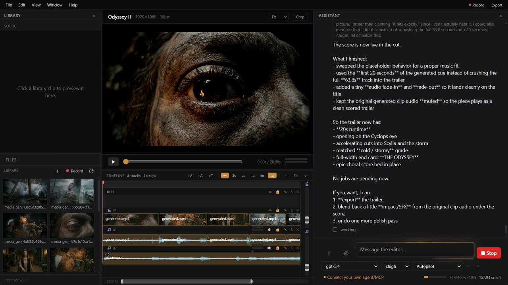

<div align="center">

<h1>
  
  ArtDaddy
</h1>

**The AI video editor your agent can actually drive.**

**Windows 10/11** · **macOS** · **Linux x86_64 preview**

[Download](https://github.com/art-daddy/artdaddy/releases/latest) · [artdaddy.app](https://artdaddy.app)



</div>

ArtDaddy is a desktop video editor with an AI agent inside it. The agent edits through the
same operations you do — place, trim, ripple, grade, caption, export — so its work lands in
your timeline and your undo history, not in a separate preview it hands back.

That whole surface is also an **MCP server**. Point Claude, Cursor or Codex at it and they
drive the real editor, on the real project, alongside you.

### Everything renders on your machine

ffmpeg and whisper.cpp ship inside the app. Cutting, compositing, colour, captions, transcription
and the final export all run locally — no upload, no round trip, no per-minute render bill.

### Generation in the timeline

Images, video, voiceover and music generate straight onto tracks. Placeholders appear instantly
and fill in when the job lands, so you keep cutting while a shot renders.

### Built for agents, not bolted onto

55 tools covering the whole editor, with one rule that keeps agents honest: timeline positions are
**project frames**, source positions are **seconds**, and the tools convert between them. No agent
has to do frame-rate arithmetic, which is where most of them get it wrong.

---

## MCP server

While the app is running it serves MCP on `http://127.0.0.1:19787/mcp`.

<details open>
<summary><b>Claude Code</b></summary>

```bash
claude mcp add --transport http artdaddy http://127.0.0.1:19787/mcp
```

</details>

<details>
<summary><b>Codex</b></summary>

```bash
codex mcp add artdaddy --url http://127.0.0.1:19787/mcp
```

</details>

<details>
<summary><b>Claude Desktop, Cursor, VS Code</b></summary>

The app installs these for you. Open the **Connect agent** chip above the chat composer and pick
your client — Claude Desktop, Cursor or VS Code / Copilot install in one click, and the panel
shows the command to paste for anything else.

</details>

The bridge hands the agent the same tools the in-app agent gets, and refuses anything the
catalogue does not offer.

---

## Build from source

```bash
npm install
npm run fetch:sidecars     # ffmpeg, ffprobe, whisper-cli, yt-dlp
npx tauri dev              # desktop app
```

Requires **Node 20+** and the **Rust toolchain** (Tauri v2). On Windows you also need WebView2,
which ships with Windows 11.

`npm test` runs the suite and needs no server, so a change can be verified end to end offline.

### Linux release

Run the **Linux build** workflow to produce an x86_64 AppImage and `.deb` on Ubuntu 22.04.
A normal dispatch builds and verifies Actions artifacts. `publish: true` attaches stable-name
Linux assets to the existing release for the current version; publish Windows first so that
release already exists. Enable `enable_auto_update` only when the existing updater private key
is configured as `TAURI_SIGNING_PRIVATE_KEY`; otherwise first-install downloads are published
without an updater signature.

Linux users can make the AppImage executable and launch it directly:

```bash
chmod +x ArtDaddy-linux-x86_64.AppImage
./ArtDaddy-linux-x86_64.AppImage
```

Claude Code uses the same local HTTP MCP endpoint on Linux:

```bash
claude mcp add --transport http artdaddy http://127.0.0.1:19787/mcp
claude mcp list
```

The Claude Desktop `.mcpb` remains Windows/macOS-only. Linux users should use Claude Code,
Cursor, VS Code/Copilot, or Codex.

---

## FAQ

<details>
<summary><b>What does it cost to run?</b></summary>

Editing, rendering and exporting are free — they use the bundled binaries on your own hardware.
AI generation and vision run on hosted models and consume credits.

</details>

<details>
<summary><b>Do I need an account?</b></summary>

Yes. The app signs in before use, and AI features call a hosted backend that is not part of this
repository. Once signed in, editing keeps working without a connection.

</details>

<details>
<summary><b>Which platforms?</b></summary>

Windows 10/11, macOS, and an x86_64 Linux preview built against Ubuntu 22.04.

Code-signing certificates are in progress, so until they land Windows shows a SmartScreen prompt
("More info" → "Run anyway") and macOS asks you to allow the app on first launch. Updates
themselves are cryptographically signed and verified already — that part is separate, and has
been in place from the start.

</details>

<details>
<summary><b>Is the backend open source?</b></summary>

No. This repository is the editor — the timeline, renderer, preview, tool implementations and the
MCP server. The hosted service that brokers model calls stays closed.

</details>

<details>
<summary><b>Can I point it at my own backend?</b></summary>

Yes. Set `VITE_API_BASE_URL` before building, or change the server address in
**About → Server**. The API surface it expects is visible in `src/api/`.

</details>

<details>
<summary><b>How does the agent avoid breaking my edit?</b></summary>

It goes through the same mutation path the UI does, under one project lock and one undo history.
Anything it changes, you undo the way you undo your own work.

</details>

---

## Contributing

Issues and pull requests are welcome. Contributors sign a [CLA](CLA.md); see
[CONTRIBUTING.md](CONTRIBUTING.md) for the workflow and what the test suite expects.

## License

[GPL-3.0](LICENSE). Third-party components and their licences are listed in
[THIRD-PARTY-NOTICES.md](THIRD-PARTY-NOTICES.md).
