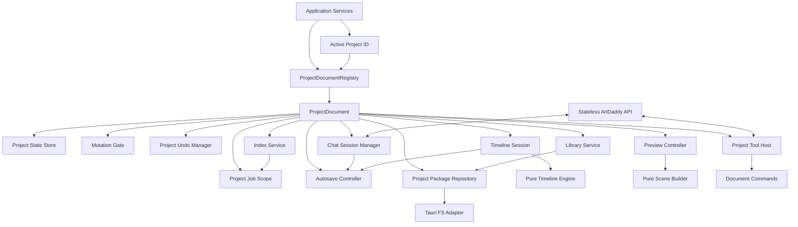
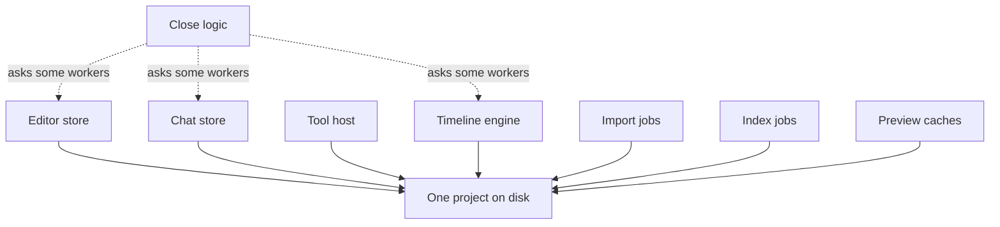
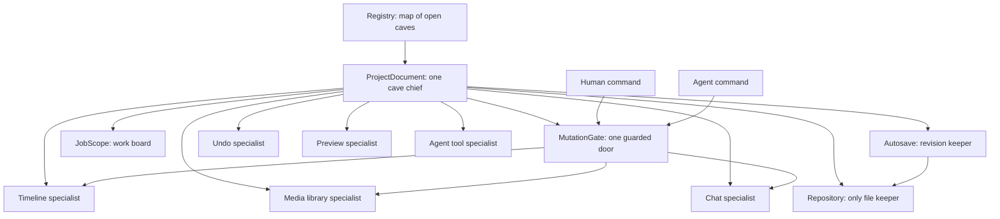

# Project Document Architecture

> Status: Owner-approved pre-alpha target
>
> Scope decision (2026-07-26, [ADR-0001](adr/0001-project-document-scope-and-persistence.md)): implement Phases 0–5, 7, 8; **DEFER Phase 6** (revisioned / whole-project-atomic persistence + three-revision recovery), the `%LOCALAPPDATA%\ArtDaddy\Projects` relocation + copy-on-first-open migration, and the cross-process single-writer lock to post-alpha (queued in `ArtDaddy/ideas.md` → `IDEA-CLIENT-PERSIST-001`). Alpha keeps the current flat per-file atomic saves; accepted residual risk: a **torn project on a crash mid-save** (no "atomic project save" claim until Phase 6 lands). External-file-change detection is DEFERRED for alpha (documented, not built — see §1.1 + the ADR-0001 Amendment).
>
> Baseline reviewed: `artdaddy` at `a1a33fd` (2026-07-26)
>
> Audience: product, client engineers, reviewers, and coding agents
>
> Scope: client-owned project state and lifecycle. The stateless ArtDaddy backend remains a separate service.

> **Implementation status (2026-07-28, post-review):** Phases 0–5, 7, 8 are implemented; Phase 6 is
> deferred (`IDEA-CLIENT-PERSIST-001`). A post-implementation review found the gate / session /
> in-memory authority reached the timeline path but NOT import / library / pack / duplicate /
> close-exit; the agreed remediation (retryable close coordinator, required project runtime with
> per-tool effect classification, flat project consistency bridge) plus the reversed import /
> external-change decisions are recorded in
> [ADR-0001 → Amendment](adr/0001-project-document-scope-and-persistence.md). Where the §6.4
> persistence invariants assume revisioning, treat them as **Phase-6 targets, not alpha requirements**;
> the alpha contract, capability rules, Phase 4, definition of done, and caveman sections are written
> to the shipped behavior. External-file-change detection is **deferred for alpha** (documented, not built).

## 1. Decision

Before alpha, ArtDaddy will move from several independently activated project stores to one
`ProjectDocument` instance per open project.

A `ProjectDocument` is the authoritative in-memory owner of one project's lifecycle and
project-scoped services. It does not implement timeline math, rendering, chat inference, or
media processing itself. It owns and coordinates the focused services that do those jobs.

The change will be implemented incrementally behind compatibility adapters. It is not a
big-bang rewrite. Every merged phase must preserve the safety guarantees already present and
must not create an interval with two authoritative owners. A compatibility adapter forwards
to the document; it never preserves an independent lifecycle or persistence path.

The governing invariant is:

> One open project has one authoritative in-memory owner. Every project mutation and every
> background result must be admitted by that owner. Close rejects new work, settles accepted
> work, persists one consistent revision, and only then disposes the project.

### 1.1 Confirmed alpha product contract

The owner confirmed these decisions on 2026-07-26. They override optional alternatives elsewhere in
this document; implementation changes require an explicit design update.

- Finish the complete project-document refactor before alpha, phase by phase.
- Alpha is Windows-only and supports projects on local internal drives only.
- ArtDaddy keeps exactly one project document loaded at a time.
- New projects live in `%LOCALAPPDATA%\ArtDaddy\Projects`, the one app-managed **ArtDaddy Projects**
  folder.
- Another ArtDaddy process holding the project writer lock causes a clear open refusal. Alpha has no
  read-only second open or conflicting-writer merge.
- Every edit changes memory immediately and schedules background autosave. Save means "make the
  current revision durable now."
- If autosave fails, editing continues with a persistent loud **Unsaved** warning plus Retry and
  Recovery Copy actions.
- If final save fails, close/exit is REFUSED via a modal offering Retry / Discard / Cancel; memory
  plus normal undo remain alive (Cancel keeps editing; Discard drops dirty memory; Retry re-saves).
- Alpha guarantees complete old-or-new state after an app/process crash. Sudden power-loss durability
  is a later goal and must not be claimed yet.
- (Phase 6 — deferred) Metadata will use readable, complete JSON revisions, keeping the latest three
  verified complete revisions as hidden crash/corruption recovery (not a user-facing Version
  History). **Alpha ships flat per-file atomic writes — no revisioning.**
- If the newest revision is damaged, automatically open the newest older verified revision, warn the
  user, and preserve the damaged bytes. (Phase 6 — deferred.) **Alpha (flat, unrevisioned):** project
  creation stages a complete project — writes `project.json` + `timeline.json`, validates both, and
  registers/opens only on success — so there is NO open-time seeding of a starter timeline and NO
  legacy-format compatibility path. A missing or corrupt `timeline.json` on open REFUSES the open with
  a "project is damaged" message (no seed, no legacy fallback, no auto-repair).
- (Phase 6 — deferred) First open of an old/outside project will stage and verify a new-format copy
  inside ArtDaddy Projects, keep the original untouched, and store an immutable metadata backup. **Alpha
  opens projects already in the ArtDaddy Projects layout — no legacy-format import/migration, no downgrade
  exporter.**
- Human and Agent edits share one normal Undo/Redo history. Normal Undo is not persisted across a
  close/reopen.
- A chat checkpoint restores timeline plus chat branch state, not the media library. Per-turn
  before/after timelines remain in the chat transcript.
- Alpha exposes one chat per project. The persisted schema and stable chat IDs are ready for multiple
  chats later, but the multi-chat UI and concurrent chat runtimes are not built for alpha.
- Local files/folders chosen by the human are linked in place, matching established NLEs. Web downloads,
  pasted/inline data, mattes, and generated media are project-owned files.
- Missing linked media stays in the project as offline and can be relinked. ArtDaddy never deletes the
  external original.
- Alpha has no Collect Media/portable-project feature. Duplicate Project keeps the same external
  links and copies project-owned media.
- Save As is not an alpha command. Duplicate Project under a new name is the copy operation.
- Local import links in place (parity with established NLEs): `import_media.source.path` accepts a file/directory,
  links it in place, and returns a stable `media_ref`; the model may pass a local path to import and
  thereafter addresses media only by `media_ref` / `clip_id`. `import_media` is the single
  model-facing import door (`library_op add.path` is removed). A human picker/drop links the same way.
- Deleting a library item used by clips immediately removes the item and all using clips across
  timelines as ONE Undo entry (parity with established NLEs — no separate affected-count confirmation step).
- Deleted project-owned bytes remain pinned while that Undo entry is reachable; garbage collection
  runs only after they can no longer be restored.
- Project deletion is refused while open/opening and otherwise moves the whole project to the Windows
  Recycle Bin.
- Normal reversible Agent edits run without per-edit approval and enter shared Undo. Paid generation,
  web download, destructive delete/overwrite, and generic command execution require approval.
- Switching projects cancels local downloads/proxies/transcription and other local work. Durable
  cloud generation IDs/placeholders are saved, resumed, and attached automatically after reopen.
- Quitting during export asks the user to Wait or Cancel. No export is silently killed while exit
  reports success.
- External-file-change detection is deferred for alpha: out-of-band edits to project JSON are not
  detected (autosave may overwrite them) — a documented limitation, revisited with Phase 6.

## 2. Why this must happen before alpha

The current client already has strong local components, but project ownership is split across:

- the editor store;
- the chat store;
- the timeline engine and module-global undo history;
- `ProjectStoreAccess` instances created by the editor, chat helpers, and tool host;
- the cached tool host;
- `IndexCoordinator`;
- preview caches and proxy generation;
- transcript persistence;
- project lifecycle maps in the coordinator.

Each component implements part of project close, cancellation, or persistence. That has
already produced these verified failure classes:

- an accepted old-session write landing after close;
- a rapid reopen reading state before the old close drained;
- a stale chat load overwriting a newer transcript;
- an aborted URL import writing media and `library.json` after close reported idle;
- old-session state attempting to update the frontmost project;
- history being recreated after close.

Adding more optional guards does not remove the root cause. The project needs one lifecycle
owner and one mandatory mutation boundary.

## 3. Plain-language glossary

| Term | Meaning in ArtDaddy |
|---|---|
| Project document | The in-memory owner of one open video project and its specialists |
| Registry | The map of project ID to open project document; it deduplicates open calls |
| Active project | Only the ID of the project currently shown in the UI |
| Command | A user-intent change such as trim clips, import media, or restore checkpoint |
| Mutation | Any operation that changes authoritative project state or live package files |
| Mutation lease | A function-scoped permission to commit one project mutation |
| Job scope | The owner of downloads, renders, transcription, proxying, and generation listeners |
| Repository | The only client service allowed to read or mutate project package files |
| Snapshot | An immutable copy of authoritative project metadata at one revision |
| Revision | A monotonically increasing committed version of project metadata |
| Derived data | Rebuildable state such as proxies, thumbnails, waveforms, and search indexes |

## 4. Goals

1. Make project identity and lifecycle ownership explicit.
2. Prevent every project-owned write after close, not only timeline writes.
3. Make open, close, reopen, delete, duplicate, recovery copy, and app exit deterministic.
4. Keep timeline, library, chat, undo, and project settings mutually consistent.
5. Let human edits and Agent edits use the same domain commands and undo history.
6. Give every background task an owner, cancellation policy, and terminal outcome.
7. Make disk persistence a durable representation of in-memory state, not the live
   coordination mechanism.
8. Preserve the existing functional timeline engine, rendering behavior, project data, and tool
  contracts during migration except the owner-approved removal of Agent raw-local-path import.
9. Keep React components focused on displaying state and forwarding user intent.
10. Make invalid architecture difficult or impossible to express through TypeScript APIs.

## 5. Non-goals

This refactor does not require:

- replacing Zustand;
- rewriting timeline operations into classes;
- changing the timeline schema or frame/second rules;
- merging WebGL preview and ffmpeg export into one renderer;
- changing server provider integrations;
- changing Agent tool schemas unless a real user-visible contract needs to change;
- adding cloud project sync;
- adding collaboration or multi-user editing;
- persisting the normal editor undo stack across application restarts;
- implementing event sourcing or CQRS;
- redesigning the UI;
- supporting multiple windows or more than one loaded project in alpha.

## 6. Core invariants

The implementation and tests must enforce all of these.

### 6.1 Identity and ownership

1. At most one live `ProjectDocument` exists for a logical project ID in one app process.
2. Concurrent `open(id)` calls resolve to the same open promise and document instance.
3. The active project is a pointer/ID, never a writable copy of project state.
4. Timeline, library, chat sessions, undo, jobs, tool host, and persistence belong to the
   same document instance.
5. A background result captured for document A can never mutate document B.

### 6.2 Lifecycle

6. A document has one explicit phase: `opening`, `open`, `closing`, `closed`, or `failed`.
7. Only `open` documents admit new mutations and new project-scoped jobs.
8. Starting close changes the phase synchronously and is idempotent.
9. Close rejects late work, cancels `cancelOnClose` jobs, waits admitted commits, flushes
   the latest dirty revision, and only then becomes `closed`.
10. A failed final save leaves the loaded document and undo state intact in a visible `failed`
  recovery state. Normal mutation admission stays closed; retry close, retry save, and current-format
  recovery export remain available. It must not silently discard the project.
11. Reopen waits for the previous close promise before loading any project metadata.
12. Delete refuses an open/opening/closing project and cannot race an open or package write.
13. One process holds the exclusive package-writer lease while a project is open or undergoing a
    registry operation. A second app instance cannot become another writer.

### 6.3 Mutations and jobs

14. Every authoritative mutation goes through `MutationGate.run`; there is no optional guard.
15. Submission is preflight-checked, then final-commit callbacks execute one at a time in FIFO
  order. Each callback reads current state only after acquiring its lease and validates the
  same document revision immediately before committing.
16. Long work does not hold the mutation lock. It stages outside the live package, then
    requests a short final commit.
17. Required lifecycle resources use automatic `try/finally` cleanup. There are no manually
    paired public `beginMutation/endMutation` calls.
18. A command returns success only when its requested state change committed to the document.
19. Fire-and-forget work may own only safely discardable derived data. Required persistence
    may never be fire-and-forget.
20. Abort/Stop is propagated to fetches, subprocesses, model requests, and loops where the
    underlying API permits cancellation.
21. Every job ends in a visible terminal state: completed, failed, cancelled, or resumable.

### 6.4 State and persistence

22. In-memory document state is authoritative while the document is open.
23. A command mutates one in-memory revision; disk writes do not drive live UI coordination.
24. A persisted revision is complete and self-consistent. Open never combines files from
    different revisions.
25. Media installation is staged and atomic. Metadata never points at partially written media.
26. Import may leave an unreferenced content-addressed file after a crash; recovery/GC may
    remove it. It may not leave metadata pointing at missing owned media.
27. Deletion commits metadata removal before physical garbage collection.
28. Linked local media is never physically deleted by ArtDaddy.
29. Derived caches are never authoritative and can be removed without losing creative work.
30. Corrupt optional metadata is preserved for recovery and never silently replaced by empty
    state.
31. Schema migration is explicit, versioned, idempotent, and tested in both directions that
    the product supports.

### 6.5 Commands and undo

32. UI and Agent entry points call the same document command for the same user intent.
33. Validation and canonicalization happen before authoritative state changes.
34. One user intent creates at most one undo entry.
35. Rejected, cancelled, unchanged, and failed commands create no undo entry.
36. Normal editor undo and conversational checkpoint restore are distinct features but share
    one document owner and explicit branch-reset semantics.
37. A checkpoint restore first invalidates the abandoned chat branch, then changes timeline and
  chat branch metadata as one document command. Results carrying the old branch identity can
  no longer commit.

## 7. Target architecture



## 8. Ownership boundaries

| State or capability | Authoritative owner | Mutation entry point | Durable representation |
|---|---|---|---|
| Open document identity/phase | `ProjectDocumentRegistry` + `ProjectDocument` | Registry lifecycle API | None; reconstructed on open |
| Active UI selection | Application store | `activate(projectId)` | Optional app preference, never project state |
| Timeline | `TimelineSession` | Document timeline commands | `ProjectSnapshot.timeline` |
| Library catalog/folders | `LibraryService` | Document library commands | `ProjectSnapshot.library` |
| Owned media bytes | `ProjectPackageRepository` | Staged library commit | Content-addressed package files |
| Linked local media | User filesystem | Human picker/drop creates read-only source capability | Catalog reference/bookmark only |
| Chat/turn/provider continuity | `ChatSessionManager` | Chat/turn document commands | `ProjectSnapshot.chats` |
| Normal undo/redo | `ProjectUndoManager` | Successful document commands | Session memory only |
| Checkpoint branch | `CheckpointController` + document command | Restore checkpoint command | Timeline + chat branch snapshot fields |
| Dirty/persisted revision | `AutosaveController` | Shared save queue | `CURRENT` + revision manifest |
| Background jobs | `ProjectJobScope` | `jobs.run(...)` | Status/placeholder only when user-valuable |
| Tool execution | `ProjectToolHost` | Narrow command/read capabilities | Receipts/chat state, not tool-local files |
| Preview/playback state | `PreviewController` | Preview controls | Not persisted unless explicitly user-facing |
| Proxy/index/thumbnail cache | Derived services | Project job scope | Rebuildable keyed cache |
| Project package paths | `ProjectPackageRepository` | Repository methods only | Filesystem layout |
| Deliverable export | Application export queue | Export command using immutable snapshot | User-selected external destination |

### 8.1 Application-level services

These outlive individual projects:

- `ProjectDocumentRegistry`;
- active project ID and routing;
- project-recents registry;
- authentication and account state;
- cloud API client;
- model/tool contract catalog;
- telemetry client;
- application settings;
- global export queue for deliverables outside projects;
- platform/Tauri adapters.

These services may reference a project by ID, but they do not own project state.

### 8.2 ProjectDocument-owned services

One instance per open project:

- project metadata/settings;
- timeline session;
- media library service;
- chat session manager and provider continuity;
- undo manager;
- mutation gate;
- job scope;
- autosave controller;
- package repository handle;
- tool host bound to document commands;
- preview controller and source cache;
- index/proxy/transcription coordinator;
- project-scoped error and dirty state.

### 8.3 Independent pure engines

These are stateless or operate only on immutable inputs. They do not know whether a project
is active or closing:

- timeline model, canonicalization, validation, and mutation helpers;
- timeline diff/receipt generation;
- frame/second conversions;
- animation/keyframe sampling;
- preview scene building;
- render-plan/ffmpeg command compilation;
- contract argument validation;
- media probe parsing;
- project snapshot schema codecs and migrations.

### 8.4 Derived infrastructure

These may be document-scoped but are never authoritative:

- preview proxies;
- posters and thumbnails;
- waveforms;
- transcripts that can be regenerated;
- search indexes;
- source URL resolution caches;
- render cache;
- temporary downloads and staged files.

## 9. Proposed module structure

This is a target organization, not a requirement to move every file immediately.

```text
src/
  project/
    ProjectDocument.ts
    ProjectDocumentRegistry.ts
    ProjectLifecycle.ts
    MutationGate.ts
    ProjectJobScope.ts
    ProjectCommands.ts
    ProjectReceipts.ts
    ActiveProject.ts
    persistence/
      ProjectPackageRepository.ts
      RevisionedJsonProjectRepository.ts
      ProjectSnapshot.ts
      ProjectMigration.ts
      ProjectRecovery.ts
    test/
      projectDocumentKit.ts

  timeline/
    session/
      TimelineSession.ts
      TimelineCommands.ts
      ProjectUndoManager.ts
    ...existing pure model/engine/helpers/render files...

  library/
    LibraryService.ts
    LibraryCommands.ts
    MediaStagingService.ts
    LibraryRepair.ts

  chat/
    ChatSessionManager.ts
    ChatModel.ts
    TurnController.ts
    CheckpointController.ts
    ChatRepositoryPort.ts

  preview/
    PreviewController.ts
    ...existing pure scene/renderer/source files...

  indexing/
    ProjectIndexService.ts

  tools/
    ProjectToolHost.ts
    adapters/
      timelineTools.ts
      libraryTools.ts
      projectTools.ts
      generationTools.ts
    ...existing pure tool argument/result helpers...
```

Existing folders may remain while slices are migrated. Ownership and dependency direction matter
more than a cosmetic file move.

## 10. Core interfaces

Names may evolve, but the capabilities and dependency direction are required.

### 10.1 ProjectDocumentRegistry

```ts
export type ProjectId = string & { readonly __brand: "ProjectId" };

export interface ProjectDocumentRegistry {
  create(input: CreateProjectInput): Promise<ProjectDocument>;
  open(projectId: ProjectId): Promise<ProjectDocument>;
  get(projectId: ProjectId): ProjectDocument | undefined;
  require(projectId: ProjectId): ProjectDocument;
  duplicate(sourceId: ProjectId, input: DuplicateProjectInput): Promise<DuplicateResult>;
  close(projectId: ProjectId, reason: CloseReason): Promise<CloseResult>;
  delete(projectId: ProjectId): Promise<DeleteResult>;
  listOpen(): readonly ProjectDocument[];
}
```

Required behavior:

- `open` is single-flight per project ID;
- an open during close waits for close, then creates one fresh instance;
- failed opens are evicted so retry can rebuild;
- `close` is idempotent and returns the existing close promise;
- registry membership is the source of truth for whether a project is open;
- paths are resolved by the package registry/repository, never accepted from callers as project
  identity.

### 10.2 ProjectDocument

```ts
export type ProjectPhase = "opening" | "open" | "closing" | "closed" | "failed";

export interface ProjectDocument {
  readonly id: ProjectId;
  readonly sessionId: string;

  phase(): ProjectPhase;
  snapshot(): ProjectSnapshot;
  subscribe(listener: (event: ProjectDocumentEvent) => void): () => void;

  readonly timeline: TimelineSession;
  readonly library: LibraryService;
  readonly chats: ChatSessionManager;
  readonly undo: ProjectUndoManager;
  readonly jobs: ProjectJobScope;
  readonly tools: ProjectToolHost;

  execute<C extends ProjectCommand>(command: C): Promise<ProjectCommandReceipt<C>>;
  save(reason: SaveReason): Promise<SaveResult>;
  exportRecoveryCopy(destination: RecoveryDestinationGrant): Promise<RecoveryCopyResult>;
  close(reason: CloseReason): Promise<CloseResult>;
}
```

`ProjectDocument` exposes domain capabilities. It must not expose raw `FsLike`, mutable lifecycle
maps, or optional liveness callbacks.

### 10.3 MutationGate

The public API must be scoped, automatic, and fail-closed.

```ts
export interface MutationGate {
  run<T>(
    request: MutationRequest,
    operation: (context: MutationContext) => Promise<T>,
  ): Promise<T>;

  beginClose(): Promise<void>;
  waitForIdle(): Promise<void>;
}

export interface MutationContext {
  readonly projectId: ProjectId;
  readonly sessionId: string;
  readonly baseRevision: number;

  assertCanCommit(): void;
}

export interface MutationRequest {
  readonly operation: string;
  readonly documentSessionId: string;
  readonly origin?: {
    readonly chatSessionId: string;
    readonly branchId: string;
    readonly executionId: string;
  };
  readonly signal?: AbortSignal;
}
```

Rules:

- callers never manually release a mutation;
- submission synchronously preflights phase, document session, branch identity when present, and
  cancellation before joining the FIFO queue;
- one callback runs at a time; it captures `baseRevision` after all earlier callbacks settle and
  re-reads current state inside the lease;
- `run` acquires, executes, and releases in `finally`;
- `assertCanCommit()` verifies that the lease is still admitted, the document session matches,
  the document revision still equals `baseRevision`, and an optional chat branch/execution is
  still current;
- after `assertCanCommit()` succeeds, the short final commit is non-cancellable: it must finish
  or roll back to a defined safe state. Cancellation applies while staging or queued, not halfway
  through an irreversible commit;
- `beginClose()` closes admission synchronously, rejects queued callbacks that have not acquired a
  lease, and waits for the one already admitted callback. That callback may finish while the
  document phase is `closing`; reopen cannot begin until it settles;
- submission after `closing` fails with `ProjectClosingError`;
- the gate tracks active commits and deterministic idle waiters;
- the gate does not remain held during a long download, render, or model call;
- any unexpected revision change is `MutationConflictError`; the complete command may retry from
  a fresh lease only when its contract is idempotent;
- mutation ordering is FIFO per document unless a future design explicitly proves otherwise.

`MutationGate.run()` is only the final commit callback. Fetching, model execution, probing,
transcoding, hashing, and other staging happen first under `ProjectJobScope`:

```ts
const staged = await document.jobs.run(
  { kind: "media.import", policy: "cancelOnClose" },
  (signal) => staging.stageMedia(source, signal),
);

try {
  return await mutationGate.run(
    {
      operation: "library.commitImport",
      documentSessionId: document.sessionId,
    },
    async (context) => {
      const current = library.snapshot();
      const transition = library.planImport(current, staged);
      context.assertCanCommit();
      return library.commitImport(context, transition, staged);
    },
  );
} finally {
  await staging.discard(staged); // Idempotent after either install or rejection.
}
```

Never call a network API, model, or unbounded subprocess from inside the mutation callback.

### 10.4 ProjectJobScope

```ts
export type ProjectJobPolicy = "cancelOnClose" | "finishBeforeClose" | "resumable";

export interface ProjectJobScope {
  run<T>(spec: ProjectJobSpec, work: (signal: AbortSignal) => Promise<T>): Promise<T>;
  cancel(jobId: string): Promise<void>;
  beginClose(): Promise<void>;
  waitForIdle(): Promise<void>;
  list(): readonly ProjectJobStatus[];
}
```

Default policy is `cancelOnClose`.

- `cancelOnClose`: downloads, local model calls, probing, proxying, transcription, indexing.
- `finishBeforeClose`: short final package commits already admitted. This must not be used for
  unbounded network/model/render work.
- `resumable`: cloud generation with a durable placeholder/job ID. Closing detaches local
  listeners after persisting resume state; reopen may resume polling.

Every job captures the document session ID. A result from an old session is discarded even if an
underlying API ignored cancellation.

### 10.5 ProjectPackageRepository

Only this layer receives raw project `FsLike` access.

```ts
export interface ProjectPackageRepository {
  acquireWriterLease(projectId: ProjectId): Promise<ProjectWriterLease>;
  load(projectId: ProjectId): Promise<LoadedProject>;
  commit(snapshot: ProjectSnapshot, expectedRevision: number): Promise<CommittedRevision>;

  stageMedia(input: MediaStageInput, signal: AbortSignal): Promise<StagedMedia>;
  installMedia(context: MutationContext, staged: StagedMedia): Promise<InstalledMedia>;
  collectGarbage(snapshot: ProjectSnapshot): Promise<GarbageCollectionReport>;

  readDerived(key: DerivedArtifactKey): Promise<Uint8Array | null>;
  writeDerived(key: DerivedArtifactKey, bytes: Uint8Array, signal: AbortSignal): Promise<void>;
  clearDerived(): Promise<void>;
}
```

Feature code must not receive `repository.fs`, `store.fs`, or arbitrary absolute writable paths.
The repository is a private `ProjectDocument` dependency, not a public document capability.
Timeline/library/chat services expose domain queries; read-only source resolution uses a separate
narrow port.

The writer lease is an OS-backed exclusive lock, held for the document lifetime and released in
`finally`; process termination releases it. Create, duplicate, delete, and migration acquire the
same package-level lease while no document is open. If another process owns the lease, alpha refuses
open with an actionable error; there is no read-only second open. Alpha supports only the local
internal filesystem containing `%LOCALAPPDATA%\ArtDaddy\Projects`.

### 10.6 ProjectSnapshot

```ts
export interface ProjectSnapshot {
  schemaVersion: number;
  projectId: ProjectId;
  revision: number;
  savedAt: string;
  project: ProjectMetadata;
  timeline: Timeline;
  library: LibraryCatalog;
  chats: PersistedChatCollection;
}

export interface PersistedChatCollection {
  activeChatId: string;
  chats: readonly PersistedChatState[];
}
```

Transient UI state, active subprocesses, decoded media, and rebuildable caches are not part of the
snapshot. Persist only user-valuable state.

Alpha enforces exactly one entry in `chats`, but persists a stable chat ID and collection envelope so
future multi-chat UI does not require another project-format migration. Alpha still constructs and
runs only one `TurnController` for the document.

## 11. Document commands

Commands represent user intent, not storage operations or UI events.

Examples:

```ts
type ProjectCommand =
  | { type: "timeline.moveClips"; moves: MoveClipInput[] }
  | { type: "timeline.trimClips"; trims: TrimClipInput[] }
  | { type: "timeline.restoreCheckpoint"; chatSessionId: string; turnId: string }
  | { type: "library.commitImport"; stagedId: string; metadata: ImportMetadata }
  | { type: "library.removeAsset"; mediaId: string; force: boolean }
  | { type: "chat.commitTurn"; chatSessionId: string; turn: PersistedTurn }
  | { type: "project.updateSettings"; patch: ProjectSettingsPatch };
```

The command pipeline is:

```text
resolve command
  -> validate full request
  -> acquire mutation gate
  -> re-read current in-memory revision
  -> apply existing pure domain operation
  -> validate resulting aggregate invariants
  -> update in-memory state exactly once
  -> register one undo record when appropriate
  -> emit one typed document event
  -> mark revision dirty / schedule autosave
  -> return a structured receipt
```

Tool handlers and UI actions adapt their inputs into these same commands.

Receipts include:

- `ok`;
- command name;
- old/new document revision;
- stable IDs created/updated/removed;
- explicit no-op state;
- clamp/coercion notes where the contract permits them;
- warnings;
- persistence state when relevant;
- structured cancellation/refusal/failure information.

### 11.1 Outcomes and error taxonomy

Expected operational outcomes use a discriminated result rather than exceptions disguised as
success:

```ts
export type ProjectFailureKind =
  | "cancelled"
  | "closing"
  | "stale_origin"
  | "conflict"
  | "invalid"
  | "not_found"
  | "offline_media"
  | "unsupported"
  | "persistence_failed"
  | "corrupt_project";

export type ProjectResult<T> =
  | { ok: true; value: T; revision: number; persistence: "dirty" | "durable" }
  | {
      ok: false;
      kind: ProjectFailureKind;
      code: string;
      message: string;
      retryable: boolean;
    };
```

Programmer errors and violated internal invariants throw and are captured at the document boundary.
UI adapters render actionable messages. Tool adapters map failures to stable machine-readable
codes and must not leak secrets, arbitrary local paths, stack traces, or success-shaped payloads.
Cancellation, no-op, and partial progress are distinct outcomes.

## 12. Timeline design

The current functional timeline core is retained.

### Keep

- timeline model and frame-domain rules;
- canonicalization;
- validation;
- helper algorithms;
- existing edit/placement/property operations;
- diff receipts;
- property-based invariant tests;
- preview/render parity tests.

### Change

- `TimelineSession` owns the current in-memory timeline for one document;
- timeline commands no longer reload `timeline.json` before every edit;
- `applyOp` is split into a pure state transition and a document command adapter;
- undo history moves from a module-global map into the document-owned undo manager;
- the global timeline bus is replaced by typed document-local events/subscriptions;
- autosave persists snapshots asynchronously and reports save failure without rolling back a valid
  in-memory edit;
- close guarantees the latest dirty revision is flushed or reports failure and remains recoverable.

Suggested pure transition shape:

```ts
export function applyTimelineCommand(
  current: Timeline,
  command: TimelineCommand,
): TimelineTransitionResult;
```

`TimelineTransitionResult` contains `next`, `receipt`, and undo/redo snapshots or inverse command.

## 13. Undo and checkpoint design

### Normal editor undo

- one `ProjectUndoManager` per document session;
- shared by manual and Agent timeline commands;
- in-memory and capped;
- cleared on successful close;
- retained if close/save fails so recovery actions do not destroy the user's working session;
- every reopen creates a new document session with an empty undo/redo stack, even in the same app
  process;
- no persistence requirement across restart;
- one user intent equals one entry;
- library/project commands may join undo only when their physical side effects are safely reversible.

### Conversational checkpoint restore

A chat checkpoint is a branch operation, not ordinary Ctrl+Z.

`CheckpointController` first resolves and fully schema-validates the checkpoint without changing
state. It then synchronously increments the chat branch ID, aborts turns/tools from the abandoned
branch, and invalidates their queued mutation origins before enqueueing the restore. An old result is
harmless even when an SDK ignores cancellation. A commit that already completed is part of the state
observed by the restore; work not yet in its non-cancellable final section cannot commit.

The restore then executes as one document command that:

1. validates the checkpoint snapshot;
2. restores the timeline;
3. updates chat turn `undone` flags/provider continuity;
4. clears normal editor undo/redo because the branch changed;
5. marks one new document revision dirty;
6. returns success only after the aggregate state committed in memory;
7. persists through the normal autosave/close path.

The UI must not independently update chat flags after a timeline function returns. The restore
clears the previous branch's normal undo/redo stacks; later edits start a fresh stack. The first
implementation rewinds timeline and chat branch state, not the media library, unless a later
versioned checkpoint schema explicitly includes library state.

Branch IDs are monotonic and never reused. If an I/O or invariant failure occurs after branch
invalidation, the old work remains invalidated, the timeline remains at its last valid revision, and
the restore returns a visible failure. Retrying creates another branch ID. A failed restore never
reactivates an abandoned Agent result.

## 14. Library and media design

`LibraryService` owns media identity, catalog state, folder metadata, external/copy ownership, and
repair logic. `ProjectPackageRepository` owns bytes.

### Import flow

Local files chosen through the trusted human picker/drop are linked, not copied:

```text
human picker/drop returns a scoped local-file grant
  -> inspect and validate the source
  -> request short mutation admission
  -> add a linked, read-only library reference
  -> update in-memory library catalog
  -> autosave metadata revision
  -> Agent receives media ID, never the source path
```

Web downloads, pasted/inline bytes, mattes, and generated outputs are project-owned:

```text
start project job (cancelOnClose)
  -> fetch/read/decode source into temporary staging outside project
  -> inspect and validate complete media
  -> hash and choose content-addressed destination
  -> request short mutation admission
  -> atomically install media if absent
  -> update in-memory library catalog
  -> validate no duplicate IDs/invalid refs
  -> commit command receipt
  -> autosave metadata revision
  -> queue derived proxy/transcript jobs
```

If close begins before final admission, staging is deleted and the operation returns cancelled. If a
crash happens after media install but before metadata persistence, the file is an unreferenced orphan
and can be collected safely.

All catalog changes serialize through the document mutation gate. Inside that lease the service
re-reads the current catalog, verifies the staged hash, and installs with rename-if-absent semantics.
An existing content-addressed destination is reused only after its hash/size matches; it is never
blindly overwritten. Concurrent imports of the same content are therefore idempotent. A failed
catalog transition may leave only a verified unreferenced file, never a reference to missing or
partial bytes. Staging cleanup runs in `finally` after success, cancellation, or failure.

If a linked source moves or becomes unavailable, keep the library item and timeline clips as offline.
Relink is a human picker command that validates compatible replacement media and updates the catalog
reference; it never gives the raw path to an Agent tool. Alpha has no Collect Media operation.

### Delete flow

```text
resolve every using clip across every timeline
  -> show affected clip count and require confirmation/Agent destructive approval
  -> in one mutation remove using clips and the catalog item
  -> create one undo record that pins all state and project-owned bytes needed to restore
  -> autosave/commit metadata revision
  -> after undo entry expires AND no retained revision references the media,
     asynchronously garbage-collect unreferenced owned media and derived cache
```

Never remove owned bytes before metadata removal commits or while Undo/recovery can restore them.
Never remove linked external user files. Undo restores the catalog item and every removed clip as one
operation.

### Repair

On open or explicit repair:

- catalog references to missing owned media are reported as damage, not silently dropped;
- unreferenced content-addressed media is recoverable/garbage-collectable;
- missing linked local media remains in the catalog as offline;
- corrupt catalog bytes are preserved;
- repair creates a visible report and a new revision only after user-approved or deterministic safe
  corrections.

## 15. Chat and Agent design

`ChatSessionManager` belongs to the document. Alpha exposes and runs exactly one conversation, while
the persisted collection envelope and stable chat ID leave room for multiple conversations later.
One conversation never owns the project.

Split current responsibilities into:

- `ChatModel`: conversations, messages, turns, provider continuity, controls;
- `TurnController`: one cancellable Agent turn and approval state machine;
- `CheckpointController`: timeline/checkpoint branch commands;
- persistence through document snapshots;
- UI adapter/hooks.

Rules:

- chat loading happens as part of document open, not in parallel through a separately constructed
  project store;
- a chat session captures document ID/session ID at creation;
- `TurnController` keeps its own execution identity for same-chat supersession;
- `Stop` aborts inference and cancellable tools;
- a late turn event is ignored unless execution ID and document session ID still match;
- tool calls invoke document command/service interfaces, never dynamic frontmost editor state;
- provider continuity is updated only by the still-current execution;
- every Agent-originated mutation carries document session, chat session, branch, and execution
  identity through final admission;
- chat state is always part of the authoritative `ProjectSnapshot`; there is no independently
  authoritative transcript writer once document snapshots are enabled;
- accepted user messages, completed/approval-waiting turns, provider continuity, and resumable job
  IDs are included in autosave. On close, an active local turn is cancelled and normalized to an
  explicit `interrupted` state before the final snapshot;
- every async generation/import result is represented by a durable job/placeholder state.
- on project switch, local jobs are cancelled. A durable cloud job ID remains in the one saved chat;
  reopen resumes polling and automatically attaches a still-valid result to its placeholder through
  fresh document admission.

## 16. Tool design

The tool registry remains, but project tools become thin adapters.

Bad target:

```ts
function importTool(args, ctx: { store: ProjectStoreAccess; runner: CommandRunner })
```

Required target:

```ts
function importTool(args, deps: {
  document: ProjectDocumentCommands;
  downloads: DownloadService;
})
```

Rules:

- tool context exposes only required capabilities;
- no tool receives raw project `FsLike`;
- the model may pass a local file/directory path ONLY to `import_media`, to LINK external media in
  place (a read-only reference returning a stable `media_ref`, parity with established NLEs). No tool writes to an
  arbitrary path, derives project identity from a path, or receives a project-internal `FsLike`;
- no tool derives project identity from an arbitrary path;
- no tool duplicates timeline/library business logic;
- project mutation tools invoke document commands;
- read tools consume immutable document snapshots or read-only service ports;
- long tools run in `ProjectJobScope` and propagate cancellation;
- generic escape-hatch tools cannot write authoritative manifests;
- results remain compatible with the server contract unless an intentional contract version change
  is made.

Approval policy for alpha:

- normal reversible timeline/library-property commands run immediately and enter shared Undo;
- paid generation, web download, destructive delete/overwrite, and generic command execution require
  explicit approval before work starts;
- destructive final commit revalidates the approval with its document session/branch identity;
- reading project state and using an already-imported media ID do not require repeated approval.

### 16.1 Security and capability boundary

- project IDs resolve to package roots through the application project registry; model/tool input
  never chooses an authoritative project path;
- create/duplicate destinations are allocated inside `%LOCALAPPDATA%\ArtDaddy\Projects` from a validated
  project name, never an arbitrary tool-supplied path. Only emergency Recovery Copy uses an opaque,
  short-lived destination grant from a human platform picker;
- repository paths are relative, normalized, reject `..` and absolute paths, and are checked after
  symlink/junction resolution so writes cannot escape the package or approved staging root;
- linked local media receives a read-only source capability. It is created by a human picker/drop OR
  by the model through `import_media` (link-in-place): the path only reads/links the external file
  into the library and never chooses an authoritative project write path. Deletion and garbage
  collection never follow the external path;
- command execution uses typed argument arrays and approved sidecars, not interpolated shell
  strings. Working directories and output paths come from narrow capabilities;
- tool permission/approval is decided before starting a paid, network, executable, or destructive
  job and is revalidated before its final document commit;
- snapshots, receipts, telemetry, and logs exclude auth tokens, provider secrets, signed URLs, and
  unnecessary absolute user paths;
- repository methods enforce these checks even when called by trusted UI code. The Agent boundary is
  not the only security boundary.

## 17. Preview, render, export, and indexing

### Preview

`PreviewController` is document-scoped because it owns playback state, source handles, and caches.
It subscribes to the document state store directly. It does not read `timeline.json` to learn about
live edits.

The pure scene builder and worker renderer remain independent.

### Render/export

Rendering compiles an immutable `ProjectSnapshot` or `Timeline` snapshot. Export does not mutate the
project package. Deliverables go outside the package.

Long-term parity direction:

```text
Timeline snapshot -> canonical RenderPlan -> WebGL adapter
                                         -> ffmpeg adapter
```

This is an incremental quality improvement, not a prerequisite for the first document slice.

### Indexing and derived media

`ProjectIndexService` runs under `ProjectJobScope`.

- `dispose()` must abort the active subprocess/API call, not only empty queues;
- failures are recorded by asset/job rather than swallowed globally;
- retries are bounded;
- queues and caches are document-scoped;
- every derived artifact key includes the authoritative input content hash/fingerprint, generation
  parameters, and algorithm/schema version. Stale artifacts miss by key rather than being mistaken
  for current output;
- raw-media proxies/transcripts are keyed by media content and are unaffected by clip placement,
  trim, speed, opacity, or canvas FPS. Timeline-derived thumbnails/render caches include the relevant
  timeline/render fingerprint;
- asset removal makes derived entries collectible but need not synchronously delete them;
- derived writes use the repository's derived-data API;
- derived jobs may never mutate timeline/library/chat state without a fresh document command;
- no derived job blocks close unless it is in a short final commit already admitted.

## 18. React integration

The UI should select an actual document store rather than use writable copied switchboards.

Target:

```tsx
<ProjectDocumentProvider document={document}>
  <EditorWorkspace />
</ProjectDocumentProvider>
```

Always-mounted UI such as the menu bar reads the application-level active project ID and resolves the
same document from the registry.

Compatibility during migration:

- keep `useEditor` and `useChat` as adapters initially;
- adapters select child state from the active `ProjectDocument`;
- `getState()` may read the active document;
- public `setState()` must be test-only or removed; it must never mutate a presentation mirror;
- components migrate gradually to `useProjectSelector` and domain action hooks;
- do not combine this architecture migration with visual redesign.

## 19. Persistence design

### 19.1 Decision

Use revisioned JSON metadata for the pre-alpha refactor. Keep content-addressed media as files.

Reasons:

- preserves inspectability and current JSON domain models;
- avoids introducing a database and migration framework during the ownership refactor;
- supports atomic publication of a complete metadata revision;
- keeps desktop and future web adapters implementable behind the same repository port;
- provides deterministic crash recovery;
- permits a later SQLite implementation without changing document/domain interfaces.

SQLite remains a valid future repository implementation, but is not required for this migration.

### 19.2 Package layout

```text
<project>/
  library/
    media_<hash>.<ext>
  internals/
    PROJECT_FORMAT.json
    state/
      CURRENT
      revisions/
        <revision-id>/
          manifest.json
          project.json
          timeline.json
          library.json
          chats.json
      staging/
        <uuid>/
      migration-backups/
        <timestamp>/
    cache/
      proxies/
      posters/
      thumbnails/
      transcripts/
      renders/
```

`PROJECT_FORMAT.json` records the format, minimum reader version, and state (`migrating` or
`revisioned`).
`manifest.json` contains schema version, project ID, revision, previous committed revision, file
hashes, and creation time.

### 19.3 Commit algorithm

1. Capture one immutable `ProjectSnapshot` from the document at revision `N` and the expected
  currently persisted revision `P`.
2. Write every metadata file to a unique staging directory.
3. Write `manifest.json` last and verify hashes by reading staged bytes.
4. Rename staging to `revisions/<N>` on the same volume.
5. Compare `CURRENT` with `P`, then atomically replace it with `<N>`.
6. Only after step 5 report revision `N` durable.
7. Retain exactly the latest three verified complete revisions (current plus two fallbacks). Remove
  older metadata revisions only after the new `CURRENT` is durable and media-GC pins are recomputed.

A crash before step 5 leaves `CURRENT` on the prior complete revision. A crash after step 5 opens the
new complete revision. Incomplete staging directories are ignored and cleaned later. Revisions must
increase but need not be contiguous because autosave may coalesce intermediate snapshots. The three
revisions are hidden recovery infrastructure, not an alpha Version History UI.

The repository must prove the publication primitive on each Windows local filesystem configuration
supported by alpha.
The required contract is: while holding the exclusive writer lease, publish a same-volume staged
revision and replace the small `CURRENT` pointer in one OS operation such that readers after an app or
process crash observe either the complete old pointer or the complete new pointer, never a missing,
partial, or concatenated pointer. Same-volume rename and replacement semantics must not be assumed
from a generic JavaScript filesystem API. If Tauri's API cannot provide the contract, add one small
Rust repository command using the platform primitive. The initial guarantee is app/process-crash
consistency. Do not claim power-loss durability unless files and parent directories are explicitly
flushed and that behavior is platform-tested.

### 19.4 Open and recovery

Open checks `PROJECT_FORMAT.json` before reading or seeding flat metadata.

For `state: "revisioned"`:

1. Read `CURRENT`.
2. Load and hash-verify that revision.
3. If invalid, try earlier committed revisions newest-first.
4. Automatically open the newest verified complete fallback, display a persistent recovery warning,
   and preserve the corrupt revision/staging bytes.

For a legacy/outside project with no marker, import/migration is a recoverable copy state machine. The
source is never upgraded in place:

1. Resolve the source from an explicit human open action or trusted legacy registry entry; it never
  becomes a general Agent path capability.
2. Load and validate all legacy metadata. Unreadable existing data is an error, never an empty seed.
3. Record source metadata/file hashes, then copy the complete package into a unique staging directory
  under `%LOCALAPPDATA%\ArtDaddy\Projects\.staging` without modifying the source.
4. Store the exact legacy metadata bytes/hashes as an immutable migration backup inside staging.
5. Convert the single transcript into a one-entry `PersistedChatCollection`, then build and verify
  revision 1 inside staging.
6. Publish `PROJECT_FORMAT.json` with `state: "migrating"`, the backup ID/hashes, and minimum reader
  version; install and verify revision 1; publish `CURRENT`; then replace the marker with
  `state: "revisioned"`.
7. Re-read/hash the source inputs. If they changed during copy, abort installation and preserve the
  original; never publish a torn mixture.
8. Reserve the original logical project ID/name, atomically rename staging to its canonical ArtDaddy
  Projects destination, and register it only after a full normal-reader verification.
9. Leave the old source package untouched and unregistered, and show the canonical copied location.
  Re-importing that old source later reports the existing logical-project conflict instead of
  silently forking or overwriting it.

Opening a `migrating` marker inside canonical staging resumes from verified backup/staging/revision
state or discards that unregistered staging copy; it never touches the legacy source and never
guesses. A revision layout without a marker is treated as interrupted or foreign state and preserved
for recovery, not adopted silently. Crash injection must cover every transition above.

### 19.5 Autosave

`AutosaveController` tracks:

- `currentRevision`;
- `dirtyRevision`;
- `persistedRevision`;
- one in-flight save;
- the latest pending snapshot;
- last error and retry state.

Rules:

- saves are serialized and coalesced to the latest snapshot;
- a save of revision N never marks N+1 durable;
- changes during save schedule another pass;
- autosave, explicit Save, close, and Recovery Copy snapshot capture use one save coordinator;
- explicit Save captures a target revision and resolves only when that revision or a newer snapshot
  is durable. It does not cancel an older atomic commit; it queues the latest snapshot behind it;
- after close shuts mutation admission and admitted commits settle, close captures one final target
  revision and waits until that revision is durable;
- close loops until `persistedRevision === dirtyRevision` or a save error is surfaced;
- required save errors are visible and retryable. During ordinary autosave failure, editing continues
  in memory with a persistent loud Unsaved warning; close/exit remains blocked until save succeeds or
  a current-format Recovery Copy is written;
- app exit awaits every open document's close/save result;
- autosave failure never pretends the document is clean.

### 19.6 Compatibility and rollback

- Phases 0-5 retain the current flat metadata layout as the sole disk authority. Adapters may change
  ownership but do not dual-write a new format.
- Before Phase 6, land a compatibility-reader gate in the legacy open path: it checks a reserved
  `PROJECT_FORMAT.json` before reading or seeding any flat metadata and refuses unknown formats or a
  `minimumReaderVersion` newer than the running client. This gate itself does not migrate projects.
- Phase 6 is enabled only after legacy fixture migration, recovery, and platform publication tests
  pass. The first successful migration writes an immutable backup and then publishes the format
  marker and revision 1.
- Clients containing the compatibility-reader gate refuse migrated projects they cannot read. Older
  binaries continue to see only the untouched legacy source at the old location; it is a separate
  backup branch and is never synchronized with the canonical Local AppData copy.
- Maintaining a live flat mirror would create two authorities and is forbidden.
- There is no old-format downgrade export. Before any project migrates, rollback is a normal code
  rollback. After migration, use a forward fix or explicitly re-import the untouched legacy source;
  release notes must state the minimum reader version.
- Keep the immutable migration backup outside the rotating three revisions. Cleanup is an explicit
  maintenance decision and never part of the critical migration commit.

### 19.7 External modification policy

Revision files are immutable to ArtDaddy after publication, but a human or outside program can still
change them. Before every save, verify the expected `CURRENT` value and hashes of the loaded revision.
If either changed:

- pause autosave and show a persistent external-change warning;
- never merge the bytes automatically and never advance `CURRENT` over them;
- offer Reload, which clearly warns before discarding unsaved in-memory edits;
- offer current-format Recovery Copy so in-memory work can be preserved elsewhere first;
- resume normal saving only after Reload/reopen establishes one authoritative revision.

## 20. Lifecycle algorithms

### 20.1 Open

```text
registry.open(id)
  -> return existing document if open
  -> return existing open promise if opening
  -> await existing close promise if closing
  -> create opening document shell and register promise
  -> resolve package and acquire its exclusive writer lease
  -> repository.load/migrate/recover one snapshot
  -> construct child services from that snapshot
  -> connect preview/index/tool adapters
  -> transition to open
  -> publish document instance
    -> on failure: transition failed, dispose partial resources, release writer lease,
      and evict open promise
```

No chat/editor/tool-host loader independently constructs a project store.

### 20.2 Activate/switch

```text
if currentId exists and currentId != nextId:
  -> await registry.close(currentId, "switch")
  -> if close/save fails, keep current project active and stop
next = await registry.open(nextId)
  -> set application activeProjectId = next.id
  -> UI selectors render next's actual stores
```

Alpha keeps exactly one project open at a time. Identity and close are registry-owned rather than
route-effect-owned. Local jobs are cancelled during close; durable cloud job IDs remain in the final
snapshot and resume after the project reopens.

### 20.3 Close

```text
document.close(reason)
  -> if closed: return existing result
  -> if closing: return existing close promise
  -> if failed: start a fresh retry close/save attempt while retaining loaded state
  -> phase = closing synchronously
  -> mutationGate.beginClose() rejects new commands
  -> jobs.beginClose() cancels/detaches according to policy
  -> abort active chat turns and tool calls
  -> await jobs that must finish and all admitted final commits
  -> flush pending in-memory metadata and autosave latest revision
  -> if save fails: retain loaded state + undo, enter visible failed recovery state,
      and allow retry close / retry save / current-format Recovery Copy
    -> on save failure stop here; do not dispose services or release the writer lease
  -> dispose preview/index/tool host/subscriptions/caches
  -> release the exclusive writer lease
  -> phase = closed
  -> remove from registry
```

### 20.4 Delete

```text
registry.delete(id)
  -> reject if document is opening/open/closing
  -> acquire application project-registry operation
  -> acquire the package writer lease or fail because another process owns it
  -> move the complete project to the Windows Recycle Bin
  -> remove registry entry only after move succeeds
  -> retain deletion-in-progress state until the Recycle Bin operation reaches a terminal outcome
```

Delete never relies on scattered writers noticing a global dead-path set. Package writers are absent
because no document is open. If the Recycle Bin operation fails, leave the package and registry entry
intact and report failure; never fall back to permanent deletion.

### 20.5 Duplicate

```text
registry.duplicate(sourceId)
  -> obtain a durable source snapshot/revision
  -> validate/reserve a unique new name inside %LOCALAPPDATA%\ArtDaddy\Projects
  -> acquire the destination package writer lease
  -> stage complete destination package under a new safe ID
  -> copy/reflink project-owned media; preserve linked-local references as links
  -> rewrite project identity in staged metadata
  -> atomically install destination directory
  -> register only after install succeeds
  -> clean staging on failure
```

### 20.6 Create

```text
registry.create(input)
  -> reserve a unique logical project ID in an application-level operation
  -> validate/reserve its name inside %LOCALAPPDATA%\ArtDaddy\Projects
  -> acquire an exclusive destination package lease
  -> build a complete revision-1 package in staging
  -> validate and atomically install the destination directory
  -> publish the project-recents entry only after install succeeds
  -> open through the normal registry path
  -> release reservation and clean staging on failure
```

### 20.7 Recovery copy

Recovery Copy is an emergency export, not Save As and not an old-format downgrade.

```text
document.exportRecoveryCopy(destinationGrant)
  -> capture and validate the latest in-memory ProjectSnapshot
  -> stage one complete current-format project package at the human-selected destination
  -> copy project-owned media and preserve linked-local references
  -> atomically publish the recovery package
  -> leave the source project identity, active document, and dirty state unchanged
  -> never register or open the recovery package implicitly
```

### 20.8 Application exit

```text
application.exit()
  -> set an application exiting flag that rejects new opens/jobs
  -> if immutable-snapshot exports are active, prompt to wait or cancel them; never silently kill
     an export while reporting success
  -> request close for every open document
  -> collect all close results; do not hide one failure behind another success
  -> if any save fails, cancel exit and show Retry / Recovery Copy choices
  -> stop global export/API/telemetry services only after document decisions settle
  -> let the platform window/process exit
```

## 21. Backend boundary

The backend remains stateless with respect to project files.

The client sends:

- immutable inference context/snapshots;
- provider continuity owned by the chat session;
- media bytes required for a server-side model call;
- stable project/transcript IDs for telemetry only.

The backend returns:

- one inference round result;
- paid generation/vision results;
- refreshed provider continuity;
- usage metrics;
- contract catalogs.

The backend must never receive a client project path or become a second timeline/library owner.

Separate backend architecture work remains necessary for durable billing, provider capability/catalog
consolidation, cancellation, and contract versioning, but it is not part of the client
`ProjectDocument` implementation. One deliberate cross-repo contract slice is required here:
`import_media.source.path` must be removed from the model-facing backend definition and generated
client catalog together. Bump the contract version, regenerate `src/contract/tools.json`, and keep a
client-side raw-path rejection so an older server catalog cannot restore the capability during a
mixed-version window. Human picker/drop import is client UI behavior and yields a media ID.

## 22. Migration plan

Every phase is a focused local commit or small commit series. Do not combine phases into one giant
change. Preserve unrelated user worktree changes.

The invariants are migration constraints, not only final-state goals. A phase may retain a legacy
implementation behind an adapter, but it may not introduce a second owner, bypass a safety guard, or
make a known race temporarily worse. Each phase has its own rollback plan and can ship only when its
acceptance tests pass.

### Phase 0: regression harness and architecture seams

Deliverables:

- add deterministic regression tests for all verified lifecycle failures;
- exclude `.stryker-tmp/**` from normal Vitest discovery;
- add test builders for document, repository, mutation, and job gates;
- introduce typed project ID/session ID/error types;
- prototype and document atomic file/directory publication behavior on the Windows local filesystem
  configurations supported by alpha before promising the revision layout;
- add the format-marker compatibility-reader gate before any revisioned project can exist;
- introduce/test the `%LOCALAPPDATA%\ArtDaddy\Projects` allocator and read-only discovery of legacy
  `%APPDATA%\ArtDaddy\projects` entries; do not relocate or change their disk authority before Phase 6;
- record current performance for open, first preview, and common timeline commands.

Required tests:

- concurrent open deduplicates;
- close is idempotent;
- reopen waits for accepted old work;
- late submission is rejected;
- failed close save keeps project recoverable;
- stale transcript cannot overwrite newer state;
- aborted URL import cannot write media/catalog;
- old document result cannot update new active project.

Phase 0 publication acceptance:

- record each Windows local filesystem configuration supported by alpha and the exact native
  replace/lock primitive used; reject unsupported/cloud/network/removable project locations;
- a child-process crash harness pauses before and after each staging, rename, pointer-replace, and
  cleanup step; reopen always selects one hash-valid complete revision;
- two app processes cannot acquire the writer lease for the same package; abrupt termination releases
  the lease and permits recovery;
- a reader loop never observes a missing/partial `CURRENT` during repeated publication;
- if Windows cannot meet the app/process-crash contract through Tauri APIs, Phase 0
  includes a tested Rust primitive and Phase 6 remains blocked until it passes;
- power-loss durability is either separately proven with file/directory flushes or explicitly remains
  outside the product claim.

### Phase 1: ProjectDocument shell and registry

Deliverables:

- add `ProjectDocumentRegistry` and lifecycle state machine;
- wrap the existing per-project editor/chat stores, host, and store access inside a document;
- construct those children exactly once from the document open path; compatibility adapters only
  select/forward to them and never invoke independent `load`, `deactivate`, or close operations;
- registry owns single-flight open and close promise;
- no change yet to timeline algorithms or persistence format;
- compatibility `useEditor/useChat` adapters still work.

Acceptance:

- one route activation calls only `registry.open(id)`;
- no separate independent editor/chat activation in `Shell`;
- concurrent editor/chat consumers await the same `registry.open(id)` promise before reading state;
- switching closes and durably saves the old document before opening the next, so alpha never has two
  loaded documents;
- one registry close call replaces editor/chat/host cleanup calls;
- existing behavior and tool contracts remain unchanged.

### Phase 2: active-project UI and per-document binding

Deliverables:

- application store contains only active project ID plus project list;
- UI selects actual child stores from the registry;
- remove writable one-way switchboard state;
- chat uses its owning document's timeline/library, never dynamic frontmost globals;
- menu bar and always-mounted components resolve the same active document.

Acceptance:

- delayed project A operations cannot change project B UI or state;
- tests exercise real document instances, not mirror-only `setState` fixtures;
- A -> B -> A activation restores each document's own state.

### Phase 3: MutationGate and ProjectJobScope

Deliverables:

- add mandatory scoped mutation API;
- add document job registry, policies, abort propagation, and terminal status;
- close uses both gates;
- migrate timeline commits, checkpoint restore, transcript persistence, imports, and project thumbnails
  first;
- fetch and command runner receive document/job abort signals.

Acceptance:

- no public manually paired begin/end API;
- no optional liveness callback on an authoritative write;
- close cannot report idle while a pre-close project job is untracked;
- late results fail both session identity and final admission checks;
- queued pre-close commits are rejected, the one already admitted short commit settles, and close
  waits for it deterministically;
- checkpoint branch invalidation rejects queued/staged results from abandoned Agent executions.

### Phase 4: ProjectPackageRepository and filesystem containment

Deliverables:

- introduce repository port and current-layout adapter;
- move all authoritative project reads/writes behind it;
- migrate library bytes/catalog, timeline, transcript, project settings, styles, and thumbnails;
- separate derived cache writes from authoritative writes;
- remove raw `store.fs` from tool and feature contexts;
- expose narrow read-only media resolver and staging APIs;
- route human picker/drop through linked-local media grants and web/pasted/generated sources through
  project-owned staging;
- restore `import_media.source.path` (link-in-place, returning a `media_ref`) as the single
  model-facing import door and remove `library_op add.path`; bump the contract version, regenerate
  the client contract, and keep the drift/mixed-version rejection test;
- keep temporary tool adapters explicit; no feature may retain raw `store`/`runner` access after its
  repository or command capability is available.

Acceptance:

- search proves no feature/tool writes under a project path except repository implementations;
- library import/delete opposite failure orderings are tested;
- linked local source deletion is impossible through repository types;
- Agent tools address media by stable `media_ref`/`clip_id`; a raw local path is accepted ONLY by
  `import_media` to link external media in place — no other tool writes to or derives identity from a path;
- confirmed cascading media delete is one undoable command and pins owned bytes until Undo plus all
  retained revision references expire;
- project create/duplicate/delete use the ArtDaddy Projects root, staged install, and Windows Recycle Bin.

### Phase 5: in-memory state and shared commands

Deliverables:

- `ProjectDocument` snapshot becomes authoritative while open;
- timeline commands apply to in-memory state using existing pure operations;
- library and the one-entry chat collection join the same aggregate revision;
- UI and Agent tools call the same document commands;
- undo moves into the document;
- global timeline bus is replaced by document-local subscriptions;
- save failure/dirty state is visible.

Acceptance:

- normal edits do not reload JSON from disk;
- out-of-band file modification is detected and handled by explicit reload/conflict UX, not silently
  merged;
- alpha exposes one chat while snapshots persist a one-entry collection with a stable chat ID;
- each command emits one state transition and one receipt;
- property/invariant tests still exercise the pure timeline pipeline.

### Phase 6: revisioned persistence and recovery

Deliverables:

- implement revisioned JSON package layout;
- legacy JSON migration to revision 1;
- cut over the canonical root through staged verified copy-on-first-open from legacy/outside sources
  into `%LOCALAPPDATA%\ArtDaddy\Projects`, never an in-place move;
- autosave controller and coalescing;
- hash verification and previous-revision recovery;
- staging/orphan cleanup;
- project creation/duplication through complete staged packages.

Acceptance:

- crash injection at every commit step always opens old complete or new complete revision;
- no mixed timeline/library/chat revision can open;
- corrupt latest revision falls back without deleting evidence;
- exactly three verified complete revisions remain after cleanup and are not exposed as Version
  History;
- close cannot return success until dirty revision is durable;
- old project fixtures migrate without semantic changes;
- legacy source mutation during copy aborts canonical installation; successful migration leaves the
  source untouched/unregistered and opens only the verified Local AppData copy;
- the format marker/minimum reader version and immutable migration backup are verified; no downgrade
  exporter or compatibility dual-write exists;
- crash tests cover publication primitive behavior on supported Windows alpha filesystems.

### Phase 7: derived services, preview, and tool cleanup

Deliverables:

- move index/proxy/transcript/thumbnail work under project job scope;
- make caches bounded and document-scoped or explicitly global with complete keys;
- migrate tool handlers to narrow domain service interfaces;
- add shared render-plan pieces where they reduce verified preview/export duplication;
- split oversized orchestration modules only along proven ownership boundaries.

Acceptance:

- disposing a document cancels active local derived work;
- cache results from old sessions are ignored;
- derived cache keys change when any authoritative input or algorithm version changes;
- preview reads document state, not persisted timeline files;
- raw package paths are not exposed to model-facing tools.

### Phase 8: remove legacy architecture

Deliverables:

- delete old per-feature lifecycle maps and optional guards;
- remove independent editor/chat registries if fully replaced by document children;
- remove writable switchboards;
- remove module-global undo history;
- remove dead adapters and duplicate persistence paths;
- update architecture docs and operational recovery docs.

Acceptance:

- there is one open/close path, one package repository, one mutation gate, and one project identity map;
- static searches and tests enforce forbidden dependencies;
- no comments claim atomicity/transactionality beyond what the implementation guarantees.

## 23. Expected code surface

Likely production areas touched over all phases:

| Area | Expected impact |
|---|---|
| `src/store/editor.ts`, `chat.ts`, `projects.ts` | High; lifecycle and active-state adapters |
| `src/tools/dataRoot.ts`, `project.ts` | High; Local AppData root, legacy discovery/copy, create/duplicate/delete |
| `src/components/Shell.tsx` and active selectors | Medium; unified activation |
| `src/timeline/engine.ts` and undo | High ownership change; low algorithm change |
| `src/tools/store.ts`, `coordinator.ts`, `host.ts`, `context.ts` | High; replaced/contained capabilities |
| `src/tools/import.ts`, `library.ts`, artifacts/styles/transcribe | High side-effect migration |
| `src/store/transcriptFile.ts`, `indexCoordinator.ts` | High ownership/job migration |
| `src/preview/*` | Medium lifecycle/cache integration; low compositor change |
| `src/timeline/render.ts` | Low for core migration; optional later decomposition |
| React feature components | Low initially; gradual selector migration |
| `src-tauri/*` | Low unless repository needs a new native primitive |
| Backend `definitions.py` + contract version | Narrow intentional removal of `import_media.source.path` |

A reasonable expectation is 35-50 production files and 20-30 test files across the entire migration,
but each slice should remain narrow and reviewable.

## 24. Rules for the junior implementing this refactor

These are mandatory.

### 24.1 Planning and scope

1. Before each slice, state the invariant being established and the exact lifecycle/failure orderings
   covered.
2. Enumerate every producer and consumer of changed state before editing.
3. Make one architectural movement per commit. Do not combine lifecycle, storage format, UI redesign,
   and unrelated cleanup.
4. Preserve public tool behavior and project data unless the slice explicitly changes a versioned
   contract.
5. Do not rename/refactor unrelated code to make a diff look cleaner.
6. Do not delete an existing safety mechanism until tests prove the replacement covers every old
   path.

### 24.2 Ownership and dependencies

7. A project-scoped service must be constructed by `ProjectDocument`, not by a component, tool, or
   global helper.
8. Feature code may not reach into another feature's Zustand store with a frontmost global lookup.
9. Tools and UI call domain commands; they do not duplicate mutation logic.
10. Only repository implementations receive raw project filesystem access.
11. Pure domain modules must not import React, Zustand, Tauri, filesystem, API clients, or lifecycle
    globals.
12. Infrastructure may depend on domain ports; domain code must not depend on infrastructure
    implementations.
13. The active project selector is presentation state only and cannot become a second authority.

### 24.3 Concurrency and lifecycle

14. Every async operation has an owner, captured document session ID, abort signal, and terminal state.
15. Every `await` before state commit requires identity/lifecycle revalidation.
16. Do not use `void promise` for required persistence, mutation, cleanup, or error reporting.
17. Do not rely on a pre-check followed by an `await`; enforce admission at the final shared boundary.
18. Cross-cutting guards are required capabilities, never optional callback parameters.
19. Do not expose manual acquire/release pairs when a scoped callback can guarantee `finally` cleanup.
20. Close must be idempotent and must return the same promise to every caller.
21. Work submitted after close begins must fail immediately, not queue behind the close marker.
22. Old-session results must be harmless even when cancellation is ignored by an SDK/process.
23. Do not hold the mutation gate during network, model, render, or transcode work.
24. Alpha may have only one loaded document. A switch that cannot close/save A must not open B.

### 24.4 Persistence and filesystem

25. Stage complete outputs outside the live package and commit them atomically.
26. Treat two atomic file writes as two operations, not a transaction.
27. Never maintain two authoritative persistence formats during migration.
28. Never overwrite unreadable project data with defaults.
29. Preserve failed/corrupt bytes and return an actionable recovery state.
30. Install bytes before metadata only when the failure leaves a safe orphan; remove metadata before
    deleting bytes.
31. Never delete or rewrite linked user-owned media.
32. Never garbage-collect project-owned media while current state, normal Undo, or one of the three
  retained revisions can restore a reference to it.
33. Every temporary path is unique and cleaned on success, failure, and cancellation.
34. Project creation and duplication become visible in the registry only after the complete package
    installs successfully.
35. Normal project create/duplicate paths come only from the app-managed ArtDaddy Projects allocator.
36. Pause saving on external revision changes; never silently merge or advance `CURRENT` over them.

### 24.5 Commands, undo, and results

37. Validate the whole request before opening an undo transaction.
38. One user intent creates one command receipt and at most one undo entry.
39. No-op, rejected, failed, and cancelled commands must report that state accurately.
40. Tool success means the requested document state changed as reported; never return success-shaped
    output after an abandoned commit.
41. Stable IDs are used across commands and receipts; object identity and array positions are not
    durable identity.
42. Checkpoint restore owns both timeline branch and chat branch changes.
43. Agent tools never receive raw local paths. A human import creates a media ID first.
44. Enforce approval before paid generation, web download, destructive delete/overwrite, and generic
  command execution; normal reversible edits do not ask again.

### 24.6 Testing and evidence

45. Every bug fix gets an adversarial regression test that fails on the old ordering.
46. Concurrency tests use deterministic gates/deferred promises, never sleeps or timing luck.
47. Test both sides of each race: close-before-commit and commit-before-close; save-before-delete and
    delete-before-save; open-before-close-drain and open-after-drain.
48. Persistence tests inject failure after every commit step.
49. Tests verify final disk and in-memory state independently; a success result alone is not proof.
50. Add static dependency/search guards for forbidden raw filesystem and frontmost-store access.
  Include a guard that production `new ProjectStoreAccess(...)` calls exist only in the temporary
  document/repository adapter, then reach zero when that adapter is removed.
51. Follow repository testing policy. Add focused tests per slice; run the required broad build/test
    gates before push, and report exactly what was and was not run.
52. Exclude generated mutation sandboxes and reports from normal test discovery.

### 24.7 Documentation and claims

53. Update this document when an intentional design decision changes.
54. Add a short ADR for storage format, lifecycle semantics, and any accepted residual risk.
55. Comments explain invariants or non-obvious framework constraints, not patch history.
56. Never claim `atomic`, `transactional`, `single owner`, `cancelled`, or `fixed` unless the code and
    tests establish the exact claim.

## 25. Forbidden shortcuts

The following are explicit review failures:

- adding another optional `stillValid`, `guard`, or `projectClosed` callback;
- adding another module-global map keyed only by `projectDir` to coordinate lifecycle;
- constructing a new `ProjectStoreAccess` to bypass document loading;
- reading the frontmost editor/chat store from a background project operation;
- letting tools call `store.fs` or write arbitrary project paths;
- making close a queued no-op marker without rejecting post-close admission;
- clearing a queue without cancelling or awaiting its active job;
- swallowing a required save/import/delete failure;
- updating chat state and timeline state in separate independent operations for one checkpoint command;
- deleting media before durable metadata no longer references it;
- writing both legacy JSON and revisioned state as competing authorities;
- rewriting working timeline/render algorithms merely to fit an object-oriented pattern;
- using a giant `ProjectDocument` method for feature logic that belongs in a child service;
- merging all phases into one unreviewable commit.

## 26. Review checklist per slice

A reviewer must be able to answer yes to every applicable question:

- Is there exactly one owner for each changed mutable state?
- Is project identity stable across editor, chat, tools, jobs, and persistence?
- Does every project mutation require document admission?
- Can close reject work submitted after it starts?
- Does close wait or cancel every already owned job according to policy?
- Can an ignored cancellation still produce a harmless stale result?
- Is raw filesystem access contained?
- Are multi-step failure orderings safe in both directions?
- Does the command return the real committed outcome?
- Is undo created only for a successful meaningful mutation?
- Do UI and Agent use the same command/domain logic?
- Does persistence open one complete revision only?
- Are corrupt bytes preserved?
- Are tests deterministic and adversarial?
- Is the diff one coherent architectural slice?

### 26.1 Adversarial test matrix

Tests use deferred promises, injected repository failures, and fake clocks where needed. They never
depend on sleeps or scheduler luck.

| Boundary/order | Required assertion |
|---|---|
| Two concurrent `open(A)` calls | One load, one promise/document instance, both callers receive it |
| `open(A)` while old A is closing | New load begins only after old close settles; session IDs differ |
| Switch A -> B and A final save fails | B never opens; A remains loaded with undo and recovery actions |
| Close while one mutation is active and one queued | Active short commit settles; queued commit is rejected; final snapshot includes only the active result |
| Mutation/job submitted after close begins | Immediate typed rejection; no staging or package write |
| SDK ignores abort and returns after reopen | Old session/branch result fails final admission and cannot affect the new document |
| Switch A -> B while A callback is delayed | A settles/cancels during close before B opens; no A callback can affect B |
| Save revision N while edit N+1 lands | Save N never marks N+1 clean; another save persists N+1 |
| Explicit Save during older autosave | Both serialize; Save resolves only when its target or newer revision is durable |
| Close during save | Admission closes first; close waits for the final target revision |
| Final save fails | Loaded state and undo survive in visible recovery state; close does not report success |
| Crash/failure after each revision commit step | Reopen selects old complete or new complete revision, never a mix |
| Latest revision/hash is corrupt | Newest verified fallback opens automatically with warning; corrupt bytes remain |
| Fourth verified revision becomes durable | Oldest metadata revision is removed; exactly three remain; referenced media pins are recomputed |
| Two writers publish from the same persisted revision | One compare-and-publish succeeds; the other gets a conflict |
| Legacy migration fails at each step | Legacy project remains readable and unmodified; incomplete staging is ignored |
| Legacy source changes during copy | Canonical install aborts; original remains untouched; no registry entry is published |
| Import closes before final admission | Staging is cleaned; no library bytes or catalog entry appear |
| Agent supplies a raw local path | Contract/context rejects it before filesystem access; human-imported media ID succeeds |
| User denies paid/web/destructive/generic approval | Typed rejection returns before staging, placeholder creation, network, subprocess, or mutation begins |
| Linked local file moves | Item and clips remain offline; Relink restores them without changing stable media ID |
| Crash after media install before metadata save | At most one verified unreferenced owned file remains; catalog has no broken reference |
| Concurrent same-content imports | Installed bytes are verified/reused and catalog identity is deterministic/idempotent |
| Confirm used-media deletion | One command removes the item and every using clip across timelines; one Undo restores all |
| GC runs while delete Undo/recovery revision is reachable | Owned bytes remain pinned; collection begins only after every restoring reference expires |
| Attempt to remove linked local media | Catalog behavior follows command policy; external source bytes are untouched |
| Checkpoint restore races an older Agent tool | Branch increments first; old queued/staged result cannot commit |
| Checkpoint restore succeeds | Timeline and chat flags/provider continuity move together; old undo/redo is cleared |
| Checkpoint restore fails after branch invalidation | Old branch stays invalid; timeline stays at last valid revision; failure is visible and retry uses a new branch ID |
| Derived job finishes after close/reopen | Cache key/session check prevents stale publication as current data |
| Resumable cloud result finishes while closed | Saved job ID resumes on reopen and attaches only through fresh valid admission |
| Duplicate/create fails before atomic install | No project registry entry and no visible partial package |
| Delete races open/save | Registry serializes them; an open/writing project is refused and a closed project goes to Recycle Bin |
| Windows Recycle Bin move fails | Project package and registry entry remain intact; no permanent-delete fallback runs |
| Path contains `..`, absolute path, symlink, or junction escape | Repository rejects it before read/write outside approved roots |
| Current revision changes outside ArtDaddy | Autosave pauses; Reload/Recovery Copy is offered; `CURRENT` is not silently advanced |
| App exits with a dirty document | Failed save blocks silent exit/data loss and keeps the document alive |
| App exits during export | Chosen wait/cancel policy reaches a visible terminal export state before process exit |

## 27. Definition of done for the full refactor

The pre-alpha project-document refactor is complete only when:

1. `Shell` activates and deactivates one `ProjectDocument`, not editor/chat/host separately.
2. One registry deduplicates open, owns close/delete lifecycle, and enforces one loaded alpha project.
3. One document owns timeline, the one alpha chat, undo, jobs, autosave, preview/index adapters,
   and tool host.
4. Every authoritative mutation uses the mandatory mutation gate.
5. Every long project job is visible in the project job scope.
6. Feature code and tools cannot access raw project filesystem mutation APIs.
7. (Phase 6 — deferred) Timeline/library/one-entry-chat-collection/project metadata will persist as
   one revisioned snapshot with three hidden complete revisions. **Alpha persists them as flat
   per-file atomic writes** (accepted residual: a torn project on a crash between two file writes).
8. In-memory state is authoritative while open; disk is not used as the live message bus.
9. UI and Agent timeline/library commands share one domain implementation.
10. Normal undo is document-owned and checkpoint restore is one aggregate command.
11. Close/reopen/delete/duplicate/app-exit behavior passes deterministic adversarial tests.
12. (Phase 6 — deferred: legacy migration.) Alpha has no legacy-format import; a missing or corrupt
    `timeline.json` on open is refused with a "project is damaged" message (no seed, no auto-repair).
13. No old-session download, import, generation listener, proxy, transcript, or chat turn can mutate
    a new/closed document.
14. Tool contracts remain intact except the intentional versioned changes: `import_media.source.path`
  is restored (link-in-place) as the single import door and `library_op add.path` is removed;
  time-unit guarantees, render output, and preview behavior remain intact.
15. Human local imports link in place by default and the model may link a local path through
  `import_media`; other Agent tools address media only by `media_ref`/`clip_id`; project-owned media
  cannot be collected while Undo/recovery references it.
16. Alpha runs on supported Windows local internal filesystems, refuses a second writer, and makes no
  power-loss durability claim.
17. Architecture docs describe the implementation that actually ships.

## 28. Design references

This design adapts standard document/workspace and supervised-session patterns used by mature editors
and agentic tools:

- native document applications and their project-ownership model;
- VS Code workspace/custom-document lifecycle, workspace edits, cancellation, and checkpoints;
- GitHub Copilot and Cursor sessions bound to explicit workspaces with permission-gated tools;
- Claude Code sessions bound to a working directory with checkpoints, permissions, and worktree
  isolation;
- Cline's workspace controller, per-task runtime, cancellation fences, and shadow-Git checkpoints.

ArtDaddy must not copy any implementation blindly. Its project contains timeline, library, media, chat,
preview/index state, and background generation, so it needs its own domain-specific aggregate and
persistence rules.

## 29. Caveman version

This section says the same thing as the technical document, but with small words and concrete
examples. The rules are still real. Only the language is simpler.

### 29.1 What ArtDaddy is

ArtDaddy is video editor with Agent.

Human can move clip.

Agent can move clip.

Both touch same project.

Desktop app owns project files, timeline, media, preview, and export. Cloud helps think, see, and
generate things. Cloud does not own project.

That part is good.

Owner chose these alpha rules:

- Windows only.
- Projects live in `%LOCALAPPDATA%\ArtDaddy\Projects` on a local internal drive.
- Old/outside project is opened from the ArtDaddy Projects folder. (Copy-and-verify-on-first-open comes
  later, in Phase 6.)
- One project loaded at a time.
- One chat shown per project. Storage already has chat IDs for more chats later.
- Edit happens in memory now. Autosave follows.
- Save each file on its own, safely. (Three complete hidden rescue saves come later, in Phase 6.)
- Local file chosen by human stays where it is. ArtDaddy links it.
- Web, pasted, and generated media belongs inside project.
- Human picks a local file; ArtDaddy links it in place. Agent can also hand a local path to
  `import_media` to link a file. After that, everyone uses the media ID.
- No Save As. Duplicate Project makes a named copy.
- No Collect Media and no old-format downgrade tool in alpha.

### 29.2 Current architecture: many chiefs in one cave

Today, one project is split between many owners:

| Current part | What it owns |
|---|---|
| Editor store | Timeline shown to human and editor actions |
| Chat store | Messages, Agent turns, checkpoints, and provider state |
| Timeline engine | Timeline reads, writes, validation, and undo history |
| Tool host | Agent tools and another way to reach project files |
| Project store access | Raw reads and writes inside project folder |
| Index coordinator | Proxy, transcript, and indexing work |
| Preview system | Playback sources, caches, and rendering state |
| Import tools | Downloads, copied media, and library catalog changes |
| Coordinator maps | Some locks, session generations, and close tracking |

Each worker knows part of project. No worker owns whole project life.

Simple picture:



Many hands have cave key.

One hand says, "Cave closed."

Other hand may still be writing on wall.

That is root problem.

### 29.3 What current architecture already does well

Do not smash good tools.

Current system has strong parts:

- Backend is stateless. Good. Server does not become second project owner.
- Timeline math is mostly pure. Good. Inputs go in; validated timeline comes out.
- Human and Agent already share many timeline operations. Good direction.
- Timeline uses project frames consistently. Raw media uses source seconds consistently.
- Preview and export are separate focused engines. They do difficult media work well.
- Timeline validation and property tests protect important invariants.
- Single-file writes already have useful atomic behavior.
- Per-project queues already serialize some timeline work.
- Agent turn loop already has explicit execution identity and Stop behavior.
- Provider integrations already use adapter-like boundaries.

Keep these engines.

Change who owns them and how they are allowed to commit work.

### 29.4 Why current design still breaks

Local lock is not same as project owner.

Each subsystem can be correct alone and project can still be wrong as whole.

#### Problem 1: close does not close everything

Example:

1. Agent starts URL import.
2. Download waits on internet.
3. User closes project.
4. Timeline queue becomes idle.
5. App says project closed.
6. Download finishes later.
7. Import writes media and `library.json` into closed project.

Close watched one road. Work came through other road.

#### Problem 2: old work can wake after reopen

Example:

1. Project A is open with session 1.
2. Old save starts and pauses.
3. User closes A and opens A again as session 2.
4. Old save wakes.
5. Without one deep session check, session 1 can write into session 2 project.

Same cave name. Different cave visit. Old worker must not confuse them.

#### Problem 3: frontmost project is not owning project

Example:

1. Agent starts work for project A.
2. User switches to project B.
3. Old callback asks, "What project is frontmost now?"
4. Callback sees B.
5. A result can update B UI or B state.

Worker must carry A identity from birth to final commit. Worker must never ask which cave happens to
be in front now.

#### Problem 4: several atomic files are not one atomic project

Suppose save does this:

1. Write new `timeline.json`.
2. Crash.
3. Never write new `library.json` or transcript.

Each file write may be atomic. Project is still mixed:

- new timeline;
- old library;
- old chat.

Three safe stones do not automatically make one safe bridge.

#### Problem 5: disk is doing two jobs

Today disk is both:

- durable saved project; and
- live message board between editor, Agent, preview, and tools.

That makes every edit do extra reads and writes. It also creates stale-read races.

While project is open, memory should be truth. Disk should be durable copy of one known revision.

#### Problem 6: guards are optional

Some call sites pass a liveness guard. Some do not.

Optional safety means forgotten safety.

Rule that applies to every mutation must live in one shared gate that no caller can bypass.

#### Problem 7: raw filesystem power leaks too far

If every tool receives raw project filesystem access, every tool can invent another write path.

Then project rules depend on every future programmer remembering every rule.

Better: one repository owns project files. Tools ask for narrow actions.

#### Problem 8: background work has no one complete work board

Downloads, proxies, transcripts, model calls, renders, and generation listeners have different
owners and different cleanup behavior.

Clearing a queue does not stop work already running.

Every job needs:

- owner;
- project session ID;
- cancellation signal;
- close policy;
- final state.

When user switches project, local work stops. Paid cloud work with durable job ID can sleep, then wake
and attach to same placeholder when project opens again.

#### Problem 9: undo and chat checkpoint are related but separate

Normal undo changes recent editor command.

Chat checkpoint restore changes conversation branch and timeline branch.

If timeline restores but chat flags fail, project tells two stories at once.

Checkpoint restore must be one project command.

### 29.5 Ideal design: one project, one chief

Ideal rule:

> One open project. One `ProjectDocument`. All project workers belong to it. All final changes ask it
> for permission.

`ProjectDocument` is chief of cave.

Chief does not personally cut video, draw preview, or talk to model.

Chief owns specialists and decides:

- when project opens;
- which session is current;
- whether new work may start;
- which mutation may commit;
- what jobs exist;
- what state is current;
- what revision is dirty;
- when save is durable;
- when project is truly closed.

This is one owner, not one giant class.

Chief coordinates. Specialists still specialize.

### 29.6 Proposed architecture in cave words



#### Registry: cave map

Registry answers:

- Is project already open?
- Is project opening?
- Is project closing?
- Must caller wait?
- Which `ProjectDocument` owns project?

Two callers open same project at same time. Registry creates one document, not two.

Alpha also allows only one loaded project total. To switch A to B, A must close and save first. If A
cannot save, B does not open.

#### ProjectDocument: cave chief

Document owns one project session and all child services.

No component creates secret second editor store, chat store, tool host, or project store.

#### MutationGate: guarded door

Only one short final mutation goes through door at a time.

Door checks:

- Is project still open for this work?
- Is document session still same?
- Is chat branch still same?
- Is Agent execution still same?
- Is state revision still what command read?
- Was operation cancelled before final commit?

If answer is no, door stays shut.

#### ProjectJobScope: work board

Every long job is written on one board.

Board knows:

- job ID;
- job kind;
- project session;
- cancellation signal;
- whether close cancels, waits, or resumes job;
- completed, failed, cancelled, or resumable result.

Close can now see all work.

#### ProjectPackageRepository: only file keeper

Only repository may change project package files.

Other code cannot reach raw `FsLike`.

Library asks repository to install verified media.

Autosave asks repository to commit full snapshot.

Tool cannot choose random project path.

#### Timeline, library, chat, preview: specialists

Each specialist keeps focused logic.

They do not own project lifecycle.

They do not decide whether old session may write.

They do not each invent separate save format.

### 29.7 How one normal edit works

Human drags clip. Or Agent asks to trim clip.

Same road:

```text
intent
  -> validate request
  -> enter mutation gate
  -> read current in-memory revision
  -> run pure timeline operation
  -> validate complete result
  -> update memory once
  -> add one undo entry
  -> emit one document event
  -> mark revision dirty
  -> schedule save
  -> return honest receipt
```

Human hand and Agent hand use same knife.

No separate Agent timeline rules.

No separate UI timeline rules.

### 29.8 How long work works

Long work must not block guarded door.

Bad:

```text
lock project
  -> download for 10 minutes
  -> inspect media
  -> write result
```

Everything waits. Close becomes hard.

Good:

```text
register cancellable project job
  -> download into temporary staging
  -> inspect and hash complete result
  -> ask mutation gate for short final commit
  -> re-check project/session/branch
  -> install verified bytes
  -> update library state
  -> clean staging
```

Long hunt happens outside cave door.

Only final delivery uses door.

Web download asks permission before hunt begins. Human local-file picker creates a linked library
item; Agent receives only its media ID.

### 29.9 How close works

Old close meaning: "I told some workers to stop."

New close meaning: "No project worker can still change project. Latest state is durable."

New close order:

```text
phase = closing now
  -> reject new mutations and jobs
  -> cancel jobs marked cancel-on-close
  -> detach resumable cloud jobs after saving their IDs
  -> abort Agent turns and tools
  -> reject queued commits
  -> let already-entered short commit settle
  -> save final complete revision
  -> if save fails, keep state and show recovery choices
  -> dispose preview, index, tools, and caches
  -> release package writer lock
  -> phase = closed
```

Close is promise, not announcement.

If final save fails, app does not pretend cave closed. It keeps memory and undo. User can retry,
or export a current-format Recovery Copy. There is no Save As command.

### 29.10 How disk save works

Project metadata is saved as numbered complete bundles.

Example:

```text
revision 40:
  project settings 40
  timeline 40
  library 40
  chat 40

revision 41:
  project settings 41
  timeline 41
  library 41
  chat 41
```

`CURRENT` says which complete bundle is active.

Save new revision like this:

1. Write all revision 41 files into staging.
2. Hash and verify all files.
3. Move complete staging folder into revisions.
4. Atomically change `CURRENT` from 40 to 41.

Crash before pointer change: open revision 40.

Crash after pointer change: open revision 41.

Never open timeline 41 with library 40.

That is real project-level consistency.

ArtDaddy keeps only three verified complete bundles: current plus two fallbacks. They stay hidden. If
current bundle is broken, ArtDaddy opens newest good fallback, warns user, and keeps broken bytes for
recovery. This protects app/process crash. Alpha does not claim sudden power-loss durability.

### 29.11 How media import and delete stay safe

Human local import order:

```text
human picks or drops file
  -> inspect file
  -> keep file where it is
  -> save read-only link in library
  -> give Agent stable media ID, not path
```

If linked file moves, item stays offline. Human can Relink it. ArtDaddy never deletes original.

Web, pasted, or generated import order:

```text
download to staging
  -> verify whole file
  -> install content-addressed media
  -> add catalog reference
  -> save metadata revision
```

Crash after media install but before catalog save may leave unused file. Unused file is safe garbage.

It must never leave catalog pointing to half file.

Deleting an item used on timelines works like this:

```text
count every using clip on every timeline
  -> ask user to confirm
  -> remove item and every using clip as one command
  -> make one Undo entry that can restore all
  -> save metadata revision
  -> keep owned bytes while Undo or one of three rescue saves can still need them
  -> garbage-collect owned bytes later
```

Crash may leave unused bytes. Safe.

Delete must never remove linked user file.

### 29.12 How checkpoint restore stays safe

User asks, "Go back to Agent turn 5."

System does:

1. Validate turn 5 checkpoint.
2. Create new chat branch ID.
3. Abort old branch work.
4. Make old branch results unable to commit.
5. Restore timeline and chat branch state together.
6. Clear normal undo/redo from abandoned branch.
7. Save one new document revision.

Media library does not rewind. Unused generated/imported media can remain safely in library.

Old Agent spear cannot land in new timeline after branch changes.

If restore fails, old branch stays dead. Valid timeline stays unchanged. Error is shown. Retry gets
new branch ID.

### 29.13 How project switch works

Switch from A to B:

1. Registry starts closing A and rejects new A work.
2. Local A jobs cancel. Resumable cloud job IDs save.
3. A final revision reaches disk.
4. If A save fails, stop and keep A open.
5. Only after A closes does registry open B.
6. App changes active project ID to B.
7. A callback can never ask frontmost project and accidentally touch B.

Active project is finger pointing at cave.

Finger is not second copy of cave.

### 29.14 How migration happens without giant rewrite

Do not replace whole cave in one night.

| Phase | Caveman task |
|---|---|
| 0 | First trap old bugs. Prove Windows file-lock/pointer behavior and discover old project roots without moving them. |
| 1 | Build registry and one document shell. Make editor, chat, and tools enter through it. |
| 2 | Make UI store only active project ID. Remove writable copied frontmost state. |
| 3 | Add mandatory mutation door and one job board. Move dangerous writes/jobs first. |
| 4 | Give raw project files to repository only. Remove filesystem power from tools. |
| 5 | Make in-memory document state truth. Make UI and Agent use same commands and undo. |
| 6 | Copy old projects safely into Local AppData, then add three revisions, backup, and warned recovery. |
| 7 | Move proxy/index/thumbnail work under job board and tighten cache keys. |
| 8 | Remove old locks, old lifecycle maps, old stores, old buses, and duplicate save paths. |

At end of every phase:

- old safety still works or new safety fully replaces it;
- only one owner exists;
- focused adversarial tests pass;
- commit is small enough to review;
- rollback plan is known.

### 29.15 Rules junior must remember

Short cave laws:

1. One project, one document owner.
2. Active project ID is pointer, not project copy.
3. Every mutation uses same mandatory gate.
4. Every long job has owner and cancellation signal.
5. Old session result never commits to new session.
6. Old chat branch result never commits to new branch.
7. Long work stages first; final commit is short.
8. Only repository writes project files.
9. One user intent makes at most one undo entry.
10. UI and Agent call same domain command.
11. Several atomic files are not one atomic project.
12. Save complete revision, then move one pointer.
13. Never overwrite unreadable data with empty defaults.
14. Never delete linked local media.
15. Never say "fixed" or "atomic" without test that proves exact claim.
16. Never remove old safety until replacement covers every path.
17. Test bad ordering, not only happy ordering.
18. No sleep-based race tests. Use controlled gates.
19. One phase per focused commit.
20. Do not rewrite good timeline/render engines for style.
21. Alpha loads one project and runs one chat.
22. Agent gets media IDs, never raw local paths.
23. Ask before paid, web-download, destructive, or generic-command work.
24. Keep exactly three complete hidden saves.
25. Do not collect owned bytes while Undo or rescue save still points at them.

### 29.16 What success looks like

Refactor is done when these questions have simple answers:

**Who owns open project?**

One `ProjectDocument`.

**Who can write project files?**

One `ProjectPackageRepository`.

**Who admits changes?**

One `MutationGate`.

**Who tracks long work?**

One `ProjectJobScope`.

**Where is live truth while open?**

One in-memory `ProjectSnapshot` owned by document.

**What does disk contain?**

One complete durable revision selected by `CURRENT`, plus two hidden verified fallbacks.

**Where do projects live?**

`%LOCALAPPDATA%\ArtDaddy\Projects` on a supported Windows local internal drive.

**Can Agent read random local path?**

No. Human imports first; Agent gets stable media ID.

**How many projects and chats run in alpha?**

One loaded project and one active chat. Chat storage is ready for more later.

**Can late old work change reopened project?**

No. Wrong document session, branch, or execution fails at final gate.

**Can UI and Agent disagree about edit rules?**

No. Both call same commands.

**Can close return while project work can still write?**

No.

That is whole design:

> Many skilled workers. One cave chief. One guarded door. One complete ledger. No ghost work after
> cave closes.
